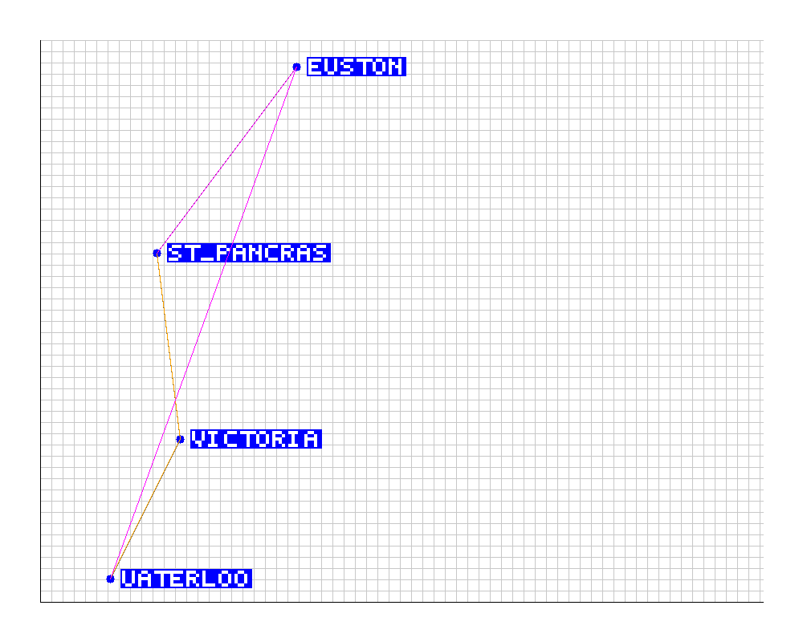

# Train Pathfinding System

## Table of Contents

1. [Introduction](#introduction)
2. [Project Structure](#project-structure)
3. [Installation](#installation)
4. [Usage](#usage)
5. [Command-Line Arguments](#command-line-arguments)
6. [Algorithm Overview](#algorithm-overview)
7. [Visualization](#visualization)
8. [Testing](#testing)
9. [Error Handling](#error-handling)
10. [Contributing](#contributing)

## Introduction

This project implements a train pathfinding system that finds optimal routes for multiple trains in a railway network. It reads a network map, calculates the best paths for a given number of trains between specified start and end stations, and simulates the train movements.

## Project Structure

The project is organized as follows:

```bash
internal-mapping-system/
├── internal/
│ ├── core/
│ │ └── occupations.go
│ ├── io/
│ │ ├── parseConnection.go
│ │ ├── parseStation.go
│ │ └── readMap.go
│ ├── model/
│ │ └── struct.go
│ ├── pathfinding/
│ │ ├── findAllPaths.go
│ │ ├── findPaths.go
│ │ ├── OptimalPaths.go
│ │ └── simTrain.go
│ └── utils/
│ │ ├── color.go
│ │ ├── error.go
│ │ └── usage.go
│ ├── visualization
│ └── ── visual.go
├── tests/
│ ├── errors
│ │ ├── 10no-start-station_london.txt
│ │ ├── 11no-end-station_london.txt
│ │ ├── 12same-start-end_london.txt
│ │ ├── ...
│ ├── stationTests_test.go
│ └── testutils_test.go
├── .gitignore
├── go.mod
├── main.go
├── network.map
└── README.md
```

## Installation

1. Clone this repository:

```bash
git clone https://github.com/raigoh/internal-mapping-system.git
```

2. Navigate to the project directory:

```bash
cd internal-mapping-system
```

## Usage

To run the program, use the following command from the project root directory:

```bash
go run . -h
```

This command will display the help message, guiding you on how to use the program and the necessary command-line arguments.

For example:

```bash
go run . network.map waterloo st_pancras 4
```

## Command-Line Arguments

- `<network_map>`: Path to the network map file
- `<start_station>`: Name of the starting station
- `<end_station>`: Name of the destination station
- `<number_of_trains>`: Number of trains to schedule (positive integer)

Additional flags:

- `-h` or `--help`: Display help message

## Algorithm Overview

1. The system reads and parses the network map from the specified file.
2. It finds all possible paths between the start and end stations using a depth-first search algorithm.
3. Optimal paths are selected based on the number of trains, minimizing conflicts and travel time.
4. The program simulates the movement of trains along their paths and outputs the results.

## Visualization

The project includes a visualization feature that generates a PNG image of the network and train paths. This visual representation helps in understanding the layout of the railway network and the routes taken by the trains.

### Key Features of the Visualization

- **Stations**: Represented as blue circles with their names in white text on a blue background.
- **Connections**: Between stations are shown as gray lines.
- **Train Paths**: Displayed in different colors (red, green, orange, magenta) for easy distinction.
- **Grid and Axes**: Included for better spatial understanding.

The visualization is automatically generated after calculating the optimal paths and saved as `network_visualization.png` in the project root directory.

### Example Visualization

Here's an example of what the visualization looks like:



In this image:

- Blue circles represent stations, with station names in white text on a blue background.
- Gray lines show connections between stations.
- Colored lines (red, green, orange, magenta) represent different train paths.
- The background grid helps with spatial orientation.

This visualization makes it easy to understand the network layout and the routes chosen by the algorithm for each train.

### How to Run the Visualization

To generate the visualization, you need to run the program with the appropriate command-line arguments. Here’s an example of how to do this:

```bash
go run . -v network.map waterloo st_pancras 4
```

## Testing

To run the tests, navigate to the project root directory and execute:

1. For network cases:

```bash
go test ./tests -v
```

2. For error cases:

```bash
go test ./tests/errors -v
```

3. For clean cache:

```bash
go run -testcache
```

## Error Handling

The program includes robust error handling for various scenarios, including:

- Invalid command-line arguments
- Non-existent map files
- Incorrect map format
- Invalid station names
- Unreachable destinations
- Maps with more than 10,000 stations

Error messages are displayed in red for better visibility.

## Contributing

Contributions are welcome! Please feel free to submit a Pull Request.
